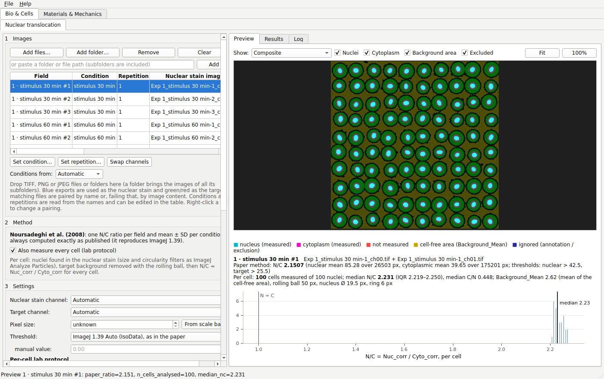
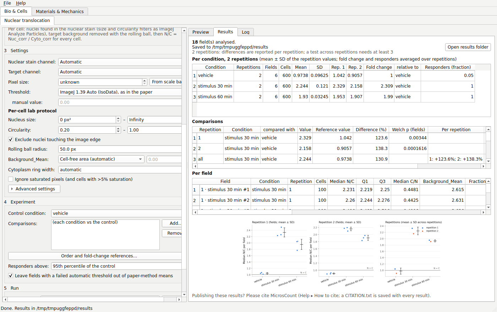
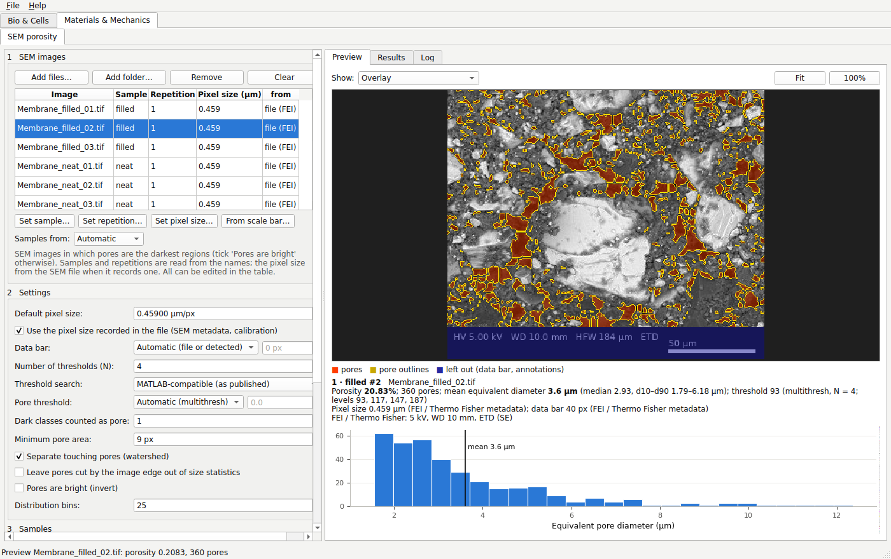
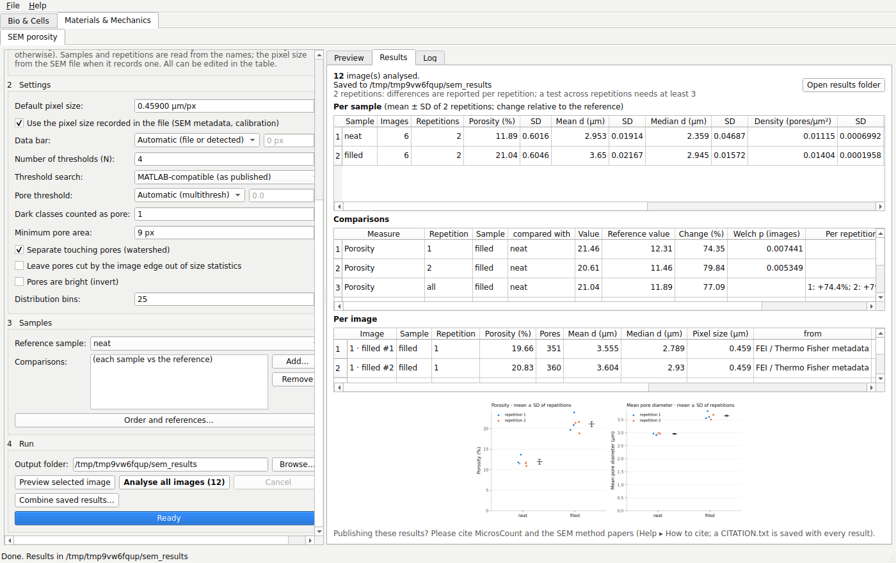

# MicrosCount

**Open-source microscopy image analysis with a point-and-click interface.** No programming needed.

MicrosCount has two modules:

| Module | Analysis | What it measures | Typical images |
|---|---|---|---|
| **Bio & Cells** | Nuclear translocation | Nuclear/cytoplasmic (N/C) intensity ratio of a protein (e.g. NF-κB p65/RelA) for every cell and every field, summarised over conditions and repetitions, with fold changes, responders and comparisons | Fluorescence or confocal: a nuclear stain (DAPI, Hoechst) + a target channel |
| **Materials & Mechanics** | SEM porosity | Porosity, pore sizes, pore-size distribution and pore density of every image, summarised over samples and repetitions, with changes against a reference sample and comparisons | Scanning electron micrographs of membranes, rocks, foams… |

It reads **TIFF, PNG and JPEG** (8/16-bit, greyscale, single-colour and merged RGB exports, multi-channel TIFF) and installs on **Windows, macOS and Linux**.

> ### 📄 Please cite
> If you use MicrosCount in published work, please cite:
>
> Acarer-Arat, S., Pir, İ., Tüfekci, M., Güneş-Durak, S., Akman, A., & Tüfekci, N. (2024). Heavy Metal Rejection Performance and Mechanical Performance of Cellulose-Nanofibril-Reinforced Cellulose Acetate Membranes. *ACS Omega*, 9(41), 42159–42171. https://doi.org/10.1021/acsomega.4c03038
>
> GitHub's **"Cite this repository"** button (right-hand panel) gives this reference in APA and BibTeX. Every results folder also contains a `CITATION.txt`, which additionally lists the method papers for the analysis you used (see [Method references](#method-references)).



---

## Download and install

Download the installer for your system from the **[Releases page](https://github.com/mertol93/microscount/releases/latest)**:

| System | File | How to install |
|---|---|---|
| Windows 10/11 (64-bit) | `MicrosCount-<version>-Windows-x64-Setup.exe` | Double-click and follow the wizard. No administrator rights needed. If SmartScreen says *"Windows protected your PC"*, click **More info → Run anyway** (the installer is not code-signed). |
| macOS, Apple silicon (M1–M4) | `MicrosCount-<version>-macOS-arm64.dmg` | Open the DMG and drag **MicrosCount** to **Applications**. On first launch, right-click the app and choose **Open**. If macOS still refuses, go to **System Settings → Privacy & Security** and click **Open Anyway**. The app is not notarised by Apple. |
| macOS, Intel | `MicrosCount-<version>-macOS-x86_64.dmg` | As above. |
| Ubuntu / Debian | `microscount_<version>_amd64.deb` | `sudo apt install ./microscount_<version>_amd64.deb`, then start *MicrosCount* from the applications menu. |
| Any Linux | `MicrosCount-<version>-x86_64.AppImage` | `chmod +x MicrosCount-*.AppImage` and double-click it. |
| Any Linux | `MicrosCount-<version>-Linux-x86_64.tar.gz` | Extract, then run `./install.sh` to add a menu entry (or run `./MicrosCount` directly). |

The Linux builds need glibc 2.35 or newer (Ubuntu 22.04, Debian 12, Fedora 36 or later).

Python users can instead run `pip install git+https://github.com/mertol93/microscount` and then `microscount`.

---

## Bio & Cells: nuclear translocation

### Quick start

1. **Add images.** Use *Add files…* or *Add folder…*, or drag files or folders onto the table. MicrosCount pairs each nuclear-stain image with its target image:
   - blue single-colour exports are the nuclear stain, green or red ones the target;
   - files are paired by name (`img_ch00`/`img_ch01`, `C1-x`/`C2-x`, `…DAPI`/`…AF488`); if names don't match, by image content (the same nuclei appear in both channels);
   - multi-channel TIFFs and merged RGB images are used as they are;
   - in a Leica LAS X export, a third channel with no signal (e.g. an unused `_ch02`) and the `MetaData` folder are skipped.

   Right-click a row to swap or change a pairing.
2. **Check the conditions and repetitions.** They are read from the names (see [Conditions and repetitions](#conditions-and-repetitions)) and can be edited in the table or with *Set condition…* / *Set repetition…*.
3. **Choose the method.** The paper method (Noursadeghi et al. 2008) is always computed. *Also measure every cell* (on by default) adds the per-cell lab protocol.
4. **Check the settings.** The defaults are the lab protocol: nuclei filtered at size 0–Infinity px² and circularity 0.20–1.00, nuclei on the image edge excluded, rolling-ball background subtraction with a 50 px radius, Background_Mean from the cell-free area. *Pixel size → From scale bar…* reads a burned-in scale bar.
5. **Describe the experiment** (optional). Choose the **control condition**, add **comparisons** (e.g. drug vs vehicle at each time point), set the order of the conditions and, if needed, a different reference for a condition's fold change. Without comparisons, every condition is compared with the control.
6. **Preview** a field. Measured nuclei are outlined in cyan, their cytoplasm is shaded magenta, the cell-free area used for Background_Mean is tinted yellow, and nuclei that are not measured are outlined in red. Hover over a cell to see its values.
7. **Analyse all fields.** Results open in the *Results* tab and are saved to a new folder next to your images.

Repetitions analysed at different times can be put together afterwards with **Combine saved results…**: choose the folder that holds their result folders. A result folder of one repetition becomes one repetition, named after the folder; conditions of one repetition analysed separately are joined by their repetition labels.

### Conditions and repetitions

- **Automatic (default).** If the file names in a folder name several conditions, as in a microscope export (`Experiment_vehicle-1_ch00.tif`, `Experiment_stimulus 30 min-2_ch00.tif` …), the condition is the file name without the shared experiment name before the first `_` and without the trailing field number, and **each folder is one repetition**. Otherwise **each folder is a condition** and its parent folder the repetition.
- **File names** or **Folder names** force one of the two.
- A field number is a number at the end of the name after `-`, `_` or `#`, in brackets, or after *field*/*pos*; a number after a plain space (`dose 10`) stays part of the condition.
- Spellings that differ only in case, spaces or separators (`stimulus 30 min`, `Stimulus-30min`) are treated as one condition, so repetitions line up; signs count (`drug +` and `drug -` are two conditions).
- Repetition labels are shortened to what tells the folders apart (`…EXPERIMENT-3`, `…EXPERIMENT-4` → `3`, `4`); folders with the same name (`day1/SEM`, `day2/SEM`) are told apart by the folders above them.
- A repetition folder that holds only one condition is read the way the other folders are (`Experiment_vehicle-1` → `vehicle`).

### How an experiment is summarised

| Level | Value |
|---|---|
| **Cell** | N/C = Nuc_corr ÷ Cyto_corr (per-cell protocol) |
| **Field** | median N/C of its measured cells (per cell), or the paper-method N/C |
| **Condition, in each repetition** | mean ± SD of its field values; fold change = value ÷ value of its reference condition (the control unless set) in the same repetition; responders = share of cells above the 95th percentile of the control's cells in the same repetition (adjustable) |
| **Condition, across repetitions** | mean ± SD of the repetition values |
| **Comparison** | in each repetition: difference and Welch's t-test on the field values; across repetitions: the difference in each repetition, whether its direction agrees, and a paired t-test on the repetition values when there are at least three repetitions |

Fields from one dish are technical replicates, so the within-repetition test is exploratory; the repetitions are the independent replicates. Paper-method means leave out fields whose automatic threshold failed (nuclear mask over 60% or under 0.2% of the field, or target mask over 97% or under 0.5%); this can be switched off.

### What you get

| File | Contents |
|---|---|
| `results.xlsx` | *Read me* (what every number means), *Summary*, *Comparisons*, *Conditions*, *Fields*, *Cells*, *Settings* and *How to cite* in one workbook |
| `summary.csv` | One row per condition: its value in each repetition, mean ± SD across repetitions, fold change, responders |
| `comparisons.csv` | Each comparison in each repetition and across repetitions |
| `per_condition.csv` | One row per repetition and condition: field values (mean ± SD), pooled cell statistics, fold change, responders, paper-method ratio |
| `per_field.csv` | One row per field: per-cell summary, paper-method ratio and its threshold check, background, warnings |
| `per_cell.csv` | One row per nucleus: position, area, perimeter, circularity, Nuc_Mean, Cyto_Mean, Background_Mean, Nuc_corr, Cyto_corr, N/C, C/N, and why it was not measured if it wasn't |
| `histograms.csv` | The paper method's normalised nuclear and cytoplasmic histograms |
| `summary.png`, `cells.png`, `histograms.png` | Field values per condition in each repetition and across repetitions; per-cell distributions; paper histograms |
| `overlays/*.png` | What was measured in every field |
| `settings.yaml` | Every setting, the experiment design and the input files. Reopen it with *File → Open settings / previous analysis* or `microscount run settings.yaml` to repeat the run. |
| `CITATION.txt` | How to cite |



### Checks

Every field is checked as it is measured, and warnings appear in the preview, the log and the *Fields* sheet: a failed automatic threshold, specks smaller than a tenth of a nucleus that pass the size filter, saturated pixels, DAPI and target channels out of register, almost no cell-free area or a Background_Mean above half the cytoplasmic level, JPEG input, and fields where no cell passed the filters.

## Materials & Mechanics: SEM porosity

### Quick start

1. **Add SEM images.** Use *Add files…* or *Add folder…*, or drag files or folders onto the table. Pores should be the darkest regions; tick *Pores are bright* otherwise.
2. **Check the samples and repetitions.** They are read from the names (see [Samples and repetitions](#samples-and-repetitions)) and can be edited in the table or with *Set sample…* / *Set repetition…*.
3. **Check the pixel size of every image.** FEI / Thermo Fisher and Zeiss SEM TIFFs record it, as do calibrated TIFFs (ImageJ, OME); the table shows where each value comes from. For other images, set a *Default pixel size* (the MATLAB script's *Resolution*), type it into the table, or measure the scale bar with *From scale bar…*. A bare TIFF resolution tag, which many programs write, counts only when there is no default, and print resolutions (72–2400 dpi) are ignored. Without a pixel size, sizes are given in pixels.
4. **Data bar.** The information bar at the bottom of an SEM image is left out automatically: its height is read from the file (FEI / Thermo Fisher) or found as a block of flat graphic rows. Choose *None* or a number of rows to override this.
5. **Describe the experiment** (optional). Choose the **reference sample** (e.g. the unmodified membrane), add **comparisons**, set the order of the samples and, if needed, a different reference for a sample's changes. Without comparisons, every sample is compared with the reference.
6. **Preview** an image. Pores are shaded red with yellow outlines and the left-out data bar is tinted blue; the original, the MATLAB-style depth map, the binary segmentation and the pore segmentation are one click away. The preview lists the porosity, pore count, pore diameters, threshold, pixel size and data bar, and any warnings.
7. **Analyse all images.** Results open in the *Results* tab and are saved to a new folder next to your images.

Repetitions analysed at different times can be put together afterwards with **Combine saved results…**: choose the folder that holds their result folders. A result folder of one repetition becomes one repetition, named after the folder; samples of one repetition analysed separately are joined by their repetition labels.



### Samples and repetitions

- **Automatic (default).** If the file names in a folder name several samples (`Membrane_neat_01.tif`, `Membrane_filled_01.tif` …), the sample is the file name without the parts all names share and without the trailing image number, and **each folder is one repetition** (an independently made membrane or batch). Otherwise **each folder is a sample** and its parent folder the repetition.
- **File names** or **Folder names** force one of the two. The naming rules are those of Bio & Cells (see [Conditions and repetitions](#conditions-and-repetitions)).

### How an experiment is summarised

| Level | Value |
|---|---|
| **Image** | porosity; pore count; mean, median, d10, d90, area-weighted mean and largest equivalent pore diameter; pore density; mean circularity |
| **Sample, in each repetition** | mean ± SD of its images; change = 100 × (value ÷ value of its reference sample − 1) in the same repetition |
| **Sample, across repetitions** | mean ± SD of the repetition values (with one repetition: of the images) |
| **Comparison** | in each repetition: difference and Welch's t-test on the image values; across repetitions: the change in each repetition, whether its direction agrees, and a paired t-test on the repetition values when there are at least three repetitions |
| **Pore-size distribution** | the share of pores and of pore area in each diameter bin, pooled over the images of a sample in each repetition and in all repetitions |

Images of one membrane are technical replicates, so the within-repetition test is exploratory; the repetitions are the independent replicates. Changes in porosity are relative (10% → 12% is +20%); the difference in percentage points is in the *Comparisons* sheet.

### What you get

| File | Contents |
|---|---|
| `results.xlsx` | *Read me* (what every number means), *Summary*, *Comparisons*, *Samples*, *Images*, *Pores*, *Distribution*, *Settings* and *How to cite* in one workbook |
| `summary.csv` | One row per sample: mean ± SD of every measure and its change against the reference |
| `comparisons.csv` | Each comparison of each measure, in each repetition and across repetitions |
| `per_sample.csv` | One row per repetition and sample, with the pores of its images pooled |
| `per_image.csv` | One row per image: every measure, the pixel size and where it came from, the data bar, the thresholds, the SEM settings recorded in the file and any warnings |
| `per_pore.csv` | One row per pore: position, area, equivalent diameter, perimeter, circularity, and whether it is cut by the image edge |
| `pore_size_distribution.csv` | Pores per diameter bin (number, %, cumulative %) and area % for each sample, per repetition and pooled |
| `summary.png`, `distribution.png` | Porosity and mean pore diameter per sample (images coloured by repetition, with mean ± SD); pore-size distributions and their cumulative curves |
| `images/*.png` | For every micrograph: the overlay, the MATLAB script's binary segmentation, depth map and pore-space segmentation, and its pore-size distribution |
| `settings.yaml` | Every setting, the experiment design and the input files. Reopen it with *File → Open settings / previous analysis* or `microscount run settings.yaml` to repeat the run. |
| `CITATION.txt` | How to cite |



### Checks

Every image is checked as it is measured, and warnings appear in the preview, the log and the *Images* sheet: a porosity above 60% or below 0.5% (are the pores the darkest class, and is the number of thresholds right?), fewer than 20 pores, more than a quarter of the pores cut by the image edge, one pore covering more than a tenth of the image, saturated pixels (charging), low contrast and JPEG input. The summary notes images without a pixel size and samples whose images were taken at different pixel sizes.

---

## Methods

### Nuclear translocation: paper method

This re-implements Noursadeghi et al. (2008), *J. Immunol. Methods* 329:194–200, as published with ImageJ 1.39:

1. a 3 × 3 median filter on both channels (ImageJ *Median…*, radius 1);
2. ImageJ 1.39's automatic IsoData threshold (*Image ▸ Adjust ▸ Threshold ▸ Auto*, with its modal-bin clipping) of each filtered channel, keeping pixels at or above the level;
3. nuclear ROI = the nuclear-stain mask; cytoplasmic ROI = target mask minus nuclear mask;
4. N/C = mean *unfiltered* target intensity in the nuclear ROI ÷ that in the cytoplasmic ROI over the whole field; zero-valued pixels are not counted, as in the paper's ImageJ histograms.

The paper's cytoplasmic ROI is thresholded on the channel being measured, and nothing is subtracted as background, so the ratio is pulled towards 1 when translocation is strong. The per-cell protocol avoids this.

### Nuclear translocation: per-cell lab protocol

The laboratory's ImageJ protocol, automated for every cell:

- **Nuclei:** the nuclear stain is smoothed (Gaussian, σ = 2 px), thresholded with the same automatic threshold, and holes are filled. Objects with more than 1.2 × the area of a typical nucleus are split along the valleys of their distance map (watershed). Particles are 8-connected and filtered as by *Analyze Particles*: size 0–Infinity px², circularity 4π·area/perimeter² between 0.20 and 1.00 with ImageJ's traced perimeter, and nuclei touching the image edge or a burned-in annotation are excluded.
- **Target:** *Process ▸ Subtract Background*, rolling ball radius 50 px, ImageJ's algorithm reproduced exactly.
- **Regions:** the nucleus; a cytoplasmic ring 0.3 × the nucleus diameter wide around it, where pixels closer to a neighbouring nucleus go to that nucleus and only pixels on a cell (target above the background noise) count; and the cell-free area of the field.
- **Values:** Nuc_Mean, Cyto_Mean and Background_Mean of the background-subtracted target; Nuc_corr = Nuc_Mean − Background_Mean, Cyto_corr = Cyto_Mean − Background_Mean, N/C = Nuc_corr ÷ Cyto_corr and C/N = Cyto_corr ÷ Nuc_corr.
- A cell is not measured, with the reason recorded, if it fails the size or circularity filter, touches the image edge or an excluded region, has fewer than 15 cytoplasm pixels, or has Cyto_corr ≤ 0. Optional: exclude saturated cells, clumps or irregular shapes.

Every filter, the rolling-ball radius, the ring and the background can be changed in the settings.

### SEM porosity

This is a Python port of `SEM_Porosity.m` by Arash Rabbani (BSD-3-Clause), the script used for the membrane SEM analysis in Acarer-Arat et al. (2024). Each MATLAB step keeps its MATLAB semantics:

1. `rgb2gray`;
2. `multithresh(I, N)`, including MATLAB's `fminsearch` search for N ≥ 3 (an *exhaustive* global search is available as an option);
3. pores are the darkest class;
4. `bwmorph(…,'majority')`;
5. a city-block distance map, `medfilt2`, and an 8-connected watershed from its regional minima to separate touching pores (Meyer's flooding in MATLAB's pixel order, so the watershed lines fall where MATLAB puts them);
6. `bwareaopen(…, 9)`;
7. equivalent pore radius = pixel size × √(area/π);
8. porosity = pore fraction before the watershed split.

Around this core, for images straight from the microscope:
- the pixel size of every image: from the SEM metadata or the TIFF calibration, typed, or a default;
- the SEM data bar, left out of every calculation;
- per pore: equivalent diameter, perimeter and circularity (ImageJ's traced perimeter); per image: diameter statistics, pore density and the checks above.

Options, all off by default so that results match the MATLAB script:
- a fixed pore threshold instead of `multithresh`;
- counting more than one dark class as pore;
- leaving edge-cut pores out of the size statistics;
- bright pores.

### Input handling

- **TIFF:** 8/16/32-bit, multi-page, multi-channel (ImageJ, OME), RGB and palette. Pixel size is read from FEI / Thermo Fisher or Zeiss SEM metadata, OME or ImageJ metadata, or the resolution tags. Z/T stacks are max-projected.
- **PNG / JPEG:**
  - greyscale, RGB, palette (decoded through the palette) and 16-bit PNG, including 16-bit RGB;
  - single-colour exports (e.g. a blue DAPI snapshot) are recognised and the populated channel is used;
  - burned-in annotations such as scale bars and text are detected from colour and excluded from every calculation.
- **Use raw exports for quantification.** Microscope "snapshots" are display-scaled 8-bit images and JPEG is lossy, so prefer raw TIFF (or 16-bit) exports.

---

## Validation

| Check | Result |
|---|---|
| ImageJ 1.39 automatic thresholds (*Auto* and *Convert to Mask*) vs ImageJ 1.39u built from source, 80 histograms | **identical** |
| Paper method vs ImageJ 1.39u on a synthetic field and on a 2048 × 2048 confocal field | identical thresholds, ROI areas, means and ratio |
| ImageJ 1.54 *Default* threshold vs ImageJ 1.54 on 2,000 random histograms | **2,000/2,000 identical** |
| Paper method with the current *Default* threshold vs ImageJ 1.54 on two 2048 × 2048 confocal fields | pixel-identical ROIs; identical means and ratios |
| Rolling ball (*Subtract Background*) vs ImageJ 1.54, radius 30, 40 and 50 px, on two confocal fields | **pixel-identical** |
| *Analyze Particles* area, perimeter and circularity vs ImageJ 1.54 (655 and 782 particles) | **identical** |
| SEM porosity vs the original MATLAB outputs (Rabbani's sample images, *Resolution* 0.459 µm) | binary segmentation and pore segmentation after the watershed split **pixel-identical**; porosity (0.09945, 0.19567), pore count (330, 453) and mean pore radius identical |
| SEM watershed vs Meyer's flooding written out pixel by pixel, on 120 random images | identical |
| Per-cell protocol on synthetic cells with a known N/C of 0.6, 1.0 and 2.5 | per-cell median 0.63, 0.99 and 2.26; the paper method gives 0.71, 1.03 and 2.18 (pulled towards 1) |

The ImageJ comparisons can be re-run with the Java programs in [`validation/`](validation). The unit tests (`pytest`) check stored ImageJ and MATLAB reference values, and `microscount selftest` runs a quick check of the main steps on any computer.

## Command line

The installers include `microscount-cli`, and a pip install provides `microscount`:

```bash
# Bio & Cells: nuclear translocation (paper method + per-cell lab protocol)
microscount bio translocation path/to/images --out results
microscount bio translocation rep1/ rep2/ rep3/ --control "vehicle" \
    --compare "vehicle" "drug" --compare "stimulus" "drug + stimulus" --out results
microscount bio translocation path/to/images --method paper          # Noursadeghi et al. 2008 only
microscount bio translocation path/to/images --size 50-inf --circularity 0.2-1 --rolling-ball 30
microscount bio combine results_rep1/ results_rep2/ --control "vehicle"   # repetitions analysed separately
microscount run results/settings.yaml                                 # repeat a saved analysis (or a combine.yaml)

# Materials & Mechanics: SEM porosity
microscount materials porosity path/to/sem --reference "neat" --out results   # pixel sizes from the SEM files
microscount materials porosity batch1/ batch2/ batch3/ --pixel-size 0.459 --reference "neat" \
    --compare "neat" "filled" --out results
microscount materials porosity path/to/sem --pixel-size 0.459 --n-thresholds 4 --data-bar 60
microscount materials combine results_batch1/ results_batch2/ --reference "neat"

microscount modules      # list the modules and analyses
microscount selftest
```

Bio & Cells options: `--conditions-from auto|name|folder`, `--repetition`, `--control`, `--compare A B` (repeatable), `--reference CONDITION REFERENCE` (repeatable), `--order`, `--responder-percentile`, `--keep-failed-paper-fields`, `--no-subfolders`.

SEM porosity options: `--pixel-size` (for images that record none), `--ignore-file-pixel-size`, `--data-bar auto|none|ROWS`, `--n-thresholds`, `--threshold GREY`, `--edge-pores-out`, `--bright-pores`, `--samples-from auto|name|folder`, `--sample`, `--repetition`, `--reference`, `--compare A B` and `--relative-to SAMPLE REFERENCE` (repeatable), `--order`, `--no-subfolders`.

`microscount translocation` and `microscount porosity` remain as shortcuts.

## Building from source

```bash
git clone https://github.com/mertol93/microscount && cd microscount
pip install -e .[dev]
pytest
microscount            # opens the GUI
```

Installers are built with PyInstaller by [`.github/workflows/build.yml`](.github/workflows/build.yml) on GitHub's Windows, macOS and Linux runners. Each frozen app runs its self-test and a headless GUI start before it is packaged. To build locally, run `packaging/build_windows.ps1`, `packaging/build_macos.sh` or `packaging/build_linux.sh`.

The code is organised by module: `microscount/bio` (nuclear translocation, file pairing, experiment summaries), `microscount/materials` (SEM porosity, sample summaries), `microscount/core` (image reading, thresholds, the ImageJ routines, naming rules, experiment statistics, figures and tables), `microscount/gui` and `microscount/cli.py`. New analyses are registered in `microscount/modules.py`.

**Releasing:** bump `__version__` in `src/microscount/_version.py` (and `version` in `CITATION.cff`), then push to `main`. CI tests the code, builds all installers and publishes release `v<version>` with the installers attached.

## Method references

Please also cite the method papers for the analysis you used. These references are in `CITATION.txt` in every results folder.

- **Nuclear translocation (paper method):** Noursadeghi, M., Tsang, J., Haustein, T., Miller, R. F., Chain, B. M., & Katz, D. R. (2008). Quantitative imaging assay for NF-κB nuclear translocation in primary human macrophages. *Journal of Immunological Methods*, 329(1–2), 194–200. https://doi.org/10.1016/j.jim.2007.10.015
- **ImageJ routines (per-cell protocol):**
  - Schneider, C. A., Rasband, W. S., & Eliceiri, K. W. (2012). NIH Image to ImageJ: 25 years of image analysis. *Nature Methods*, 9(7), 671–675. https://doi.org/10.1038/nmeth.2089
  - Sternberg, S. R. (1983). Biomedical image processing. *Computer*, 16(1), 22–34. https://doi.org/10.1109/MC.1983.1654163
- **SEM porosity (original MATLAB code):**
  - Rabbani, A., & Salehi, S. (2017). Dynamic modeling of the formation damage and mud cake deposition using filtration theories coupled with SEM image processing. *Journal of Natural Gas Science and Engineering*, 42, 157–168. https://doi.org/10.1016/j.jngse.2017.02.047
  - Ezeakacha, C. P., Rabbani, A., Salehi, S., & Ghalambor, A. (2018). Integrated image processing and computational techniques to characterize formation damage. *SPE International Conference and Exhibition on Formation Damage Control*.

## Licence

MicrosCount is free software under the **GNU General Public License v3.0 or later** (see [`LICENSE`](LICENSE)). It comes with no warranty.

It bundles third-party components under their own licences, including Qt for Python (LGPL-3.0) and A. Rabbani's SEM_Porosity (BSD-3-Clause); see [`THIRD_PARTY_NOTICES.md`](THIRD_PARTY_NOTICES.md).

Bug reports and suggestions are welcome on the [issue tracker](https://github.com/mertol93/microscount/issues).
